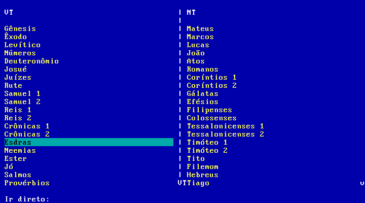
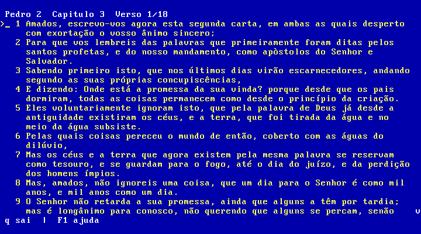

# Biblia ACF para DOS

Leitor da Biblia ACF em modo texto para DOS, feito em Turbo Pascal.
O projeto usa dados binarios (`ACF.DAT`, `ACF.IDX`, `ACF.MET`) e executa no DOSBox-X/FreeDOS.

## Screenshots

### Tela de livros



### Tela de leitura



## Estrutura principal

- `BIBLIA.PAS`: fonte principal (Turbo Pascal)
- `BIBLIA.EXE`: executavel DOS compilado
- `make_dos_data.py`: gera `ACF.DAT`, `ACF.IDX`, `ACF.MET` a partir de JSON
- `ACF.DAT` / `ACF.IDX` / `ACF.MET`: base de dados da Biblia
- `START.BAT`: inicializa codepage/teclado e executa o leitor
- `TP55/`: Turbo Pascal 5.5

## Rodar no DOSBox-X

No DOS (dentro do DOSBox-X), com os arquivos na mesma pasta:

```dos
START.BAT
```

Teste rapido de leitura de arquivos:

```dos
BIBLIA.EXE /T
```

## Compilar o EXE (Turbo Pascal 5.5)

Dentro do DOSBox-X:

```dos
TPC.EXE /B BIBLIA.PAS
```

Tambem pode compilar direto no host chamando DOSBox-X:

```bash
dosbox-x -fastlaunch -exit \
  -c "mount c /home/pi/dos_biblia" \
  -c "c:" \
  -c "cd \\" \
  -c "TP55\\TPC.EXE /B BIBLIA.PAS"
```

## Gerar os dados ACF

```bash
python3 make_dos_data.py --json /caminho/para/acf_clean.json
```

Saida esperada: `ACF.DAT`, `ACF.IDX`, `ACF.MET`.

## Teclas principais

- `Enter`: selecionar
- `ESC` / `b`: voltar
- `q`: sair
- `F1`: ajuda
- `Setas` / `PgUp` / `PgDn`: navegar
- Livros: `Left/Right` alterna entre colunas VT/NT
- Livros: digite `ap 22 1` e `Enter` para ir direto (livro/capitulo/verso)
- Leitura: `Left/Right` muda capitulo
- Leitura: `g` vai para verso

## Acentos (CP850)

Os dados estao em `CP850` (pt-BR). Se os acentos sairem errados, use codepage 850.

O `START.BAT` ja aplica:

- `CHCP 850`
- `KEYB BR 850`

## GitHub

O repositorio ja esta inicializado em `main`. Para publicar:

```bash
git remote add origin https://github.com/SEU_USUARIO/SEU_REPO.git
git push -u origin main
```
